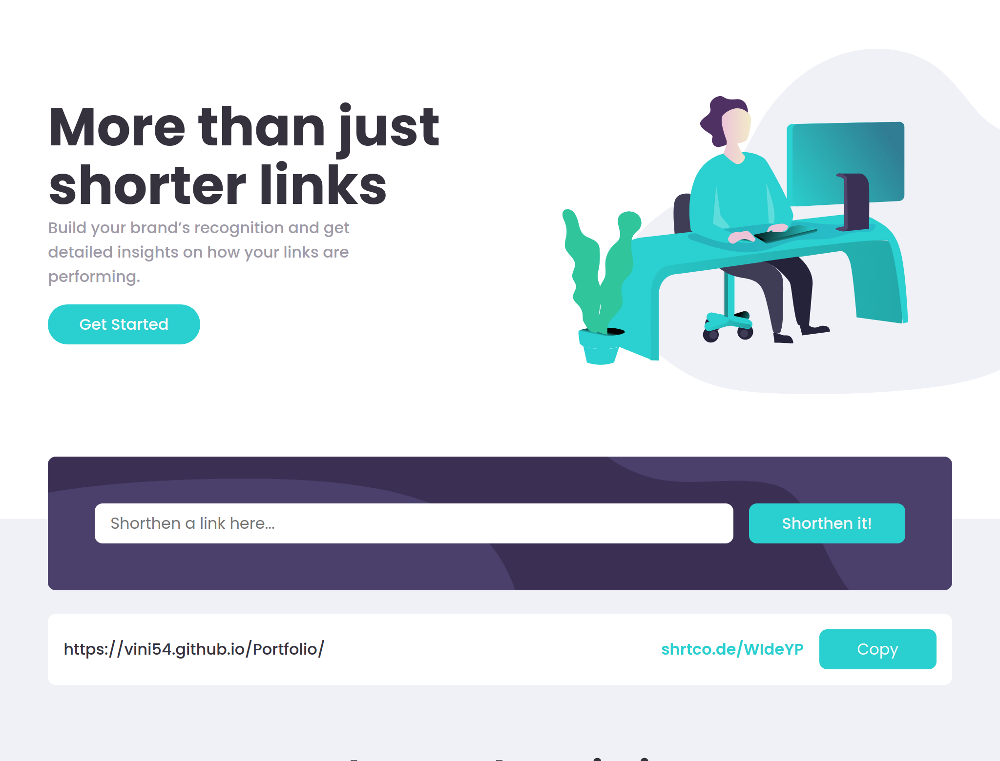
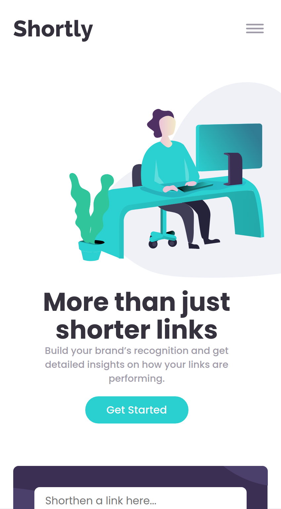

# Frontend Mentor - Shortly URL shortening API Challenge solution

This is a solution to the [Shortly URL shortening API Challenge challenge on Frontend Mentor](https://www.frontendmentor.io/challenges/url-shortening-api-landing-page-2ce3ob-G). Frontend Mentor challenges help you improve your coding skills by building realistic projects.

## Table of contents

- [Overview](#overview)
  - [The challenge](#the-challenge)
  - [Screenshot](#screenshot)
  - [Links](#links)
- [My process](#my-process)
  - [Built with](#built-with)
- [Author](#author)
- [Acknowledgments](#acknowledgments)

## Overview

### The challenge

Users should be able to:

- View the optimal layout for the site depending on their device's screen size
- Shorten any valid URL
- See a list of their shortened links, even after refreshing the browser
- Copy the shortened link to their clipboard in a single click

### Screenshot

- desktop

- mobile 

### Links

- Solution URL: [Add solution URL here](https://your-solution-url.com)
- Live Site URL: [vercel link](url-shortening-woad.vercel.app)

## My process

### Built with

- React - vite
- Typescript
- [Axios](https://axios-http.com/) for api
- [React](https://reactjs.org/) - JS library
- [Styled Components](https://styled-components.com/) - For styles

## Author

- Portfólio - [Vinícius Oliveira](https://vini54.github.io/Portfolio/)
- Frontend Mentor - [@vini54](https://www.frontendmentor.io/profile/vini54)
- Github - [@vini54](https://github.com/vini54)
